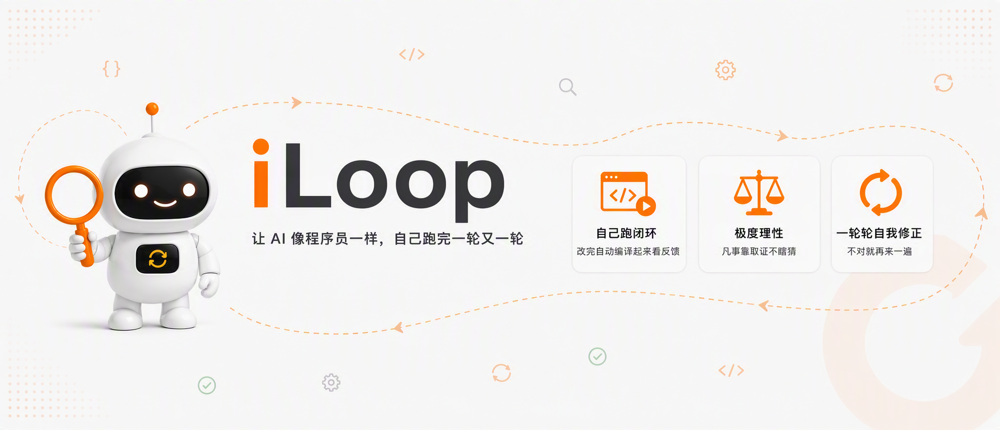

# iLoop

<p align="center">
  
</p>

> 让 AI 像程序员一样，在真实反馈里一轮轮修正；说“完成”之前，先拿证据自证。

iLoop 是一层给研发 Agent 使用的**反馈闭环底座**。

人类程序员很少能一次把代码写对。我们会读项目规则、查过去踩过的坑，写完再编译、看日志、跑设备、抓 UI、看崩溃，然后根据结果继续修。真正让代码逐渐变对的，不只是“会写”，而是这套持续获得反馈、修正判断的工作循环。

Agent 缺的往往正是这套循环。它能生成代码，却未必能自己拿到一手反馈；任务一长，还会忘目标、凭感觉发挥、自己给自己验收，最后用一句“应该没问题”收尾。

iLoop 把这些缺失的部分接起来：

```text
目标与上下文
    ↓
选择工作流和放权等级
    ↓
修改代码
    ↓
编译 / 日志 / UI 树 / 截图 / Crash
    ↓
证据是否支持结论？
    ├─ 否 → 带着证据修正，再跑一轮
    └─ 是 → 独立验收 / 四关收敛 / 记录经验
```

这套做法叫 **VDD（Verification-Driven Development，面向验证的开发）**：完成的定义不是“代码写完了”，而是“结果被验过了”。

[完整设计思路](DESIGN.md) · [VDD 方法论](docs/VDD.md) · [二次开发](EXTENDING.md)

---

## 它能干什么

iLoop 不是另一个更会生成代码的模型。它给现有 Agent 补上研发交付所需的工作循环：

- **按任务选工作流**：排查、修复、需求、重构、验收、环境问题走不同的路径，不让 Agent 一上来凭感觉乱做。
- **按风险决定放权**：L1 只看不改、L2 小步修改、L3 授权后连续执行。
- **用真实反馈纠偏**：验数据看日志，验控件看 UI 树，验最终表现看截图，验崩溃看 crash report。
- **把任务当持续档案**：记录现象、候选原因、证据和下一步检查，长任务换会话也能继续。
- **区分观测和推断**：真跑看到的是 `observed`，从源码推出来的是 `inferred`，两者不能混为一谈。
- **换一个 Agent 做关键验收**：高风险改动不让执行者自己盖章。
- **沉淀长期经验**：工程坑进入错题本，下次先召回，不从零再踩一次。
- **展示交付过程**：轮次、证据、止损和验收进入提效看板，而不是只留下聊天记录。
- **从整体复核改动**：收口读取完整 diff，检查公共定义、调用方、共享边界和删除逻辑，防止局部补丁都对、整体架构却持续变坏。

开源版当前提供平台无关内核和一个 iOS 官方插件，支持：

- 模拟器与真机的 build / install / launch
- 截图、UI 层级树、日志和 crash report
- 基于 Appium WebDriverAgent 的真机 UI 自动化
- 可复用 UI Flow（`verified` 由宿主证明的运行态证据写入），以及 Task/Case/Capability Gate/独立验收/全局复核的硬收口
- 本机 Xcode 自动发现，不依赖全局 `xcode-select`

---

## 和现有框架有什么不同

iLoop 不想替代 Spec Kit、Codex、Ralph、Superpowers 或各种 Harness 方法。它补的是这些系统下游经常缺失的一层：**真实执行后的反馈与验收**。

| 方向 | 主要解决什么 | iLoop 补什么 |
|---|---|---|
| Codex / 通用 Coding Agent | 规划、生成、修改、持续执行 | 不能只靠模型判断“已经达标”，要接入可复核的工程证据 |
| Spec Kit | 把需求拆成规范、计划和任务 | 规范完成后，继续在真实工程和设备里落地、验证、收口 |
| Ralph Loop | 让同一目标持续循环推进 | 不只“继续跑”，还要知道每轮该看什么反馈、何时能停 |
| Superpowers / Skills | 把方法和工具封装成可复用能力 | 把这些能力组织进同一条证据闭环，并约束验收边界 |
| Harness / Loop Engineering | 解释 Agent 为什么需要前馈、反馈和循环 | 把这些原则落成能在本机运行的 Agent 入口、内核和平台插件 |

所以 iLoop 更像一层**反馈底座**：它可以插到现有 Agent 或研发链路的某个节点，把“生成完就结束”变成“拿到真实结果后继续修正，验过才结束”。

---

## 核心设计

### 1. VDD：验过才算数

Agent 的结论必须落到证据。收敛时检查四件事：

1. **时间对得上**：证据与现象来自同一次发生。
2. **范围对得上**：证据覆盖了实际受影响范围。
3. **机制说得通**：能解释为什么会发生。
4. **有反证**：换一个关键条件，现象应该消失或发生变化。

### 2. 工作流与放权等级

`plan` 根据任务选择 flow，并给出所需文档、取证方向、升级条件和下一步建议。flow 不是教条清单，而是让 Agent 在开工前先确定“这类问题应该怎么想”。

- **L1 只看不改**：调查、取证、分析。
- **L2 动手改**：最小改动、可回滚、改后验证。
- **L3 放手干**：用户明确授权、有任务清单和验收标准后连续执行。

### 3. 长期记忆不是一个大知识库

iLoop 把记忆拆成不同用途：

- `AGENT_PROMPT.md` 和 `prompts/`：稳定规则与场景方法。
- `workflow/flows.json` 和诊断专家：一类任务应该怎么思考。
- `Case`、`Ledger` 和证据文件：当前任务进行到了哪里。
- `LessonBook` 和 `seed_lessons/`：过去踩过什么坑、怎么避免。

每轮只加载命中的方法和最小证据缺口，避免把所有历史塞进上下文。

### 4. 关键验收换一个视角

低风险改动由主 Agent 自核；公共逻辑或高风险链路触发独立验收。验收 Agent 只拿验收标准和证据，不拿执行过程，避免被原来的推理路径带偏。

### 5. 判断力、业务和平台分开

```text
稳定判断力：VDD / 工作流 / 病例 / 验收 / 错题本
业务领域层：业务材料 / 领域 flow / 专项脚本 / 角色
平台执行层：iOS / 监控 / 日志 / CI / IM / 其他工具
```

换业务只替换领域层，换平台只替换执行插件，主循环不用重写。

更完整的推导见 [DESIGN.md](DESIGN.md)。

---

## 快速开始

前置条件：

- Python 3.9+。内核只用标准库，不需要 `pip install`。
- 使用 iOS 插件需要 macOS + Xcode。
- iOS 编译、运行和模拟器 UI 自动化使用公开的 [XcodeBuildMCP](https://github.com/getsentry/XcodeBuildMCP) CLI。
- 真机 WDA UI 自动化额外需要 `iproxy`。

```bash
git clone https://github.com/Job-Yang/iloop.git
cd iloop

# 平台无关的内核自测（Linux/macOS 均可）
python3 -m host_cli selftest

# 看 iLoop 会怎么处理一个任务
python3 -m host_cli plan "帮我修复下单页崩溃"
```

需要执行 iOS build/run/UI 时，再在 macOS 安装公开执行底座：

```bash
brew tap getsentry/xcodebuildmcp
brew install xcodebuildmcp

# iOS 环境体检
python3 -m host_cli doctor

# 创建可恢复任务；能力结果、轮次和看板写入 ~/.iloop/data/
export ILOOP_PROJECT_ROOT=/path/to/your/app
python3 -m host_cli run "帮我修复下单页崩溃" \
  constraints="不改公共 API" \
  acceptance="编译通过;拉起无 crash"

# 中断或换会话后恢复
python3 -m host_cli tasks
python3 -m host_cli resume <task_id> caps=build,run,logs \
  workspace=App.xcworkspace scheme=App sim_udid=<simulator-id> \
  subjects=Sources/Feature.swift,Tests/FeatureTests.swift

# 查看证据缺口给出的下一动作；重构收口前逐项复核完整 diff
python3 -m host_cli next <task_id>
python3 -m host_cli global-review prepare <task_id> project_root=$ILOOP_PROJECT_ROOT

# 高影响改动：生成验收包；本地 review 只做 preflight
python3 -m host_cli accept prepare <task_id>
python3 -m host_cli accept review <task_id>
```

`host_cli` 是开源版默认入口。它把本地执行事实的完整性记录放在任务目录之外的
`~/.iloop/host-trust/`，防止仅编辑任务状态文件改变结论；它不是同一 OS 用户下的
独立身份边界。`independent_review`、`user_confirmation` 和
`evidence_subjects` 必须来自外部 Agent 宿主，默认本地账本拒绝签发和验证。
内置 `accept review` 只启动只读 preflight，永远不签发最终 `pass`。

`python3 -m cli` 保留为低层 fail-closed 调试入口：它可以规划和取证，但不能
自行给 Task policy、平台完成或独立验收签字，因此不能完成 `wrapup`。

宿主集成入口只有一个：

```python
runtime = Runtime(
    data_dir,
    registry,
    plugin,
    project_root=project_root,
    attestation_recorder=host.record,  # 只记录宿主实际观察到的事实
    attestation_verifier=host.verify,  # 受信状态必须保存在任务进程外
)
```

`host.record(kind, path, payload)` 与 `host.verify(kind, path, payload)` 必须按
事实类型分权；尤其不能向执行任务的 Agent 暴露 `independent_review`、
`user_confirmation` 或任意 `evidence_subjects` 的签发入口。外部验收结果通过
`runtime.record_external_acceptance(task, result_path)` 回写。把本地文件哈希
原样写回同一目录不构成宿主证明。

`project_root` 用于隔离不同工程的数据；也可固定设置 `ILOOP_PROJECT_ROOT`。任务、证据和看板默认写入 `~/.iloop/data/<project-id>/`，不污染业务仓。

然后把仓根的 [AGENT_PROMPT.md](AGENT_PROMPT.md) 作为项目规则或 Agent
入口加载到 Claude Code、Codex、Cursor 或自建宿主。默认调用
`python3 -m host_cli`；提示词、内核、宿主适配和插件一起随仓库分发。

---

## 二次开发：不是让人手写插件，而是让 Agent 自己接

扩展机制首先是**给 Agent 看的开发协议**。

使用者不需要先理解 manifest、flow schema 或内核接口。可以直接对已经加载 iLoop 的 Agent 说：

> 基于 iLoop 做一个代码排查 Agent。
> 基于 iLoop 做一个智能 oncall Agent。
> 给我们团队增加一个发布回归工作流。

Agent 会按入口协议自动完成：

1. 判断这是公共核心能力还是业务扩展；归属不清先让用户选择。
2. 读取 [EXTENDING.md](EXTENDING.md)。
3. 执行 `extension-init` 创建隔离扩展。
4. 只修改扩展目录，不改 iLoop 核心。
5. 执行 `extension-validate` 检查命名空间和越界。
6. 用一个真实任务再次运行 `plan`，确认新 flow 能被命中。

扩展作者真正需要关心的只有业务目标、输入、输出和验收口径。内核里的接口规范是 Agent 和插件之间的“插座标准”，不是普通用户的必修课。

---

## 当前状态

版本 `0.2.1`，当前范围是**平台无关内核 + 本地完整性宿主入口 + iOS 官方插件**。

- selftest 250 条断言全绿：内核 175 + iOS 插件 75。
- 公开 CI 额外运行 fresh-clone managed-host 旅程，覆盖低风险 Task 的四关与最终 `wrapup`，并验证高风险任务在缺外部 reviewer 时 fail closed。
- Task、Case、Gate、Ledger、Evidence 可持久化，`run/resume/tasks` 可跨会话恢复。
- `wrapup` 不可绕过：步骤证据、平台回读、Case resolved、四关、全局影响复核和必要的外部验收必须全部通过。
- 全局视角在 Task 创建时固定 Git commit，读取任务期完整 diff；识别公共定义、Objective-C selector、动态路由/DI、行为配置文件、仓内调用方和删除逻辑，并给出受影响测试建议。L2/L3 改动逐项覆盖定义与调用方，后续提交或补丁会自动让旧结论失效。
- 外部 Evidence、平台回读、用户确认和独立验收均绑定 task/run/flow/subject、产物哈希与有效期；CLI 传入的 `subjects` 不会进入证据，覆盖范围只能由插件实际产出或进程外宿主证明。
- inputs manifest、Constitution、结构化 blocker、records 和 UI Flow 已进入工程数据层。
- 模拟器 build/run/install/launch/UI tree/tap/swipe/type/screenshot/probe 统一走 XcodeBuildMCP CLI。
- 已用 XcodeBuildMCP 生成公开结构的 SwiftUI fixture，真实跑通模拟器 build-and-run、UI tree、截图、tap 和本次 run 绑定日志。
- `logs` 只归档本次 `run` 绑定的动态日志；没有真实日志时明确失败。
- 真机 build/install/launch 走 XcodeBuildMCP；固定版本、官方 commit 与 origin 的公开 WDA 由 `ui_prepare/ui_status/ui_stop` 管理；crash 走 `devicectl`。
- 真机已发现并验证到一台已配对的 iPhone；设备构建已进入 provisioning 阶段。完整真机 build/install/launch/WDA E2E 仍等待有效 Apple Developer 登录态创建 `dev.iloop.e2e` 的 development profile；真机动作目前使用 WDA 坐标，不与模拟器的语义 `elementRef` 冒充一致。

MIT License。欢迎使用、修改和二次开发。
